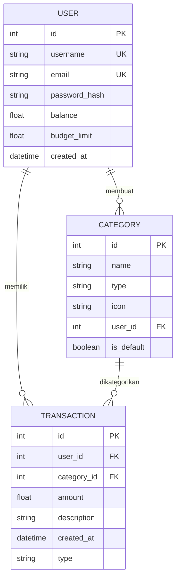

# 💰 FinTrack - Personal Finance Tracker

Aplikasi pencatat keuangan pribadi berbasis web untuk mengelola pemasukan dan pengeluaran, mengatur budget bulanan, dan melihat ringkasan keuangan dengan antarmuka modern dan responsif.


---

## 🎯 Fitur Utama

### 🔐 Autentikasi & Keamanan
- Registrasi & Login dengan validasi ketat
- Login fleksibel menggunakan **email** atau **username**
- **Password Strength Checker** real-time
- Konfirmasi password saat registrasi
- **Rate Limiting** (5 percobaan per menit) proteksi brute force
- Reset password dengan alur aman berbasis session

### 💰 Manajemen Keuangan
- Dashboard ringkasan dengan kartu saldo 3D interaktif
- CRUD transaksi (Tambah, Edit, Hapus) untuk pemasukan & pengeluaran
- **Kategori dinamis** – default (Gaji, Makanan, Transportasi, dll) + kategori custom per user
- Budget bulanan dengan indikator persentase
- Perhitungan saldo otomatis dengan logika bisnis (polimorfisme OOP)

### 📊 Analisis & Monitoring
- Grafik tren saldo historis (ApexCharts)
- Total pemasukan, total pengeluaran, dan jumlah transaksi
- Progress bar budget dengan animasi & peringatan jika melewati batas
- Filter & pencarian transaksi (teks, kategori, tanggal, sorting)

### 📱 Responsive Design
- Mobile-first, adaptif di semua perangkat
- Sidebar dengan hamburger menu untuk navigasi mobile
- Dual view transaksi: **List** (tabel) dan **Card** (kartu)
- Filter collapsible di mobile

### 🛠️ Fitur Lanjutan
- **Export CSV** – unduh data transaksi
- **Bulk Delete** – hapus banyak transaksi sekaligus dengan checkbox
- **API Endpoints** untuk pencarian, filter, dan penghapusan massal
- **Kategori Custom** – tambahkan kategori sendiri saat mencatat transaksi
- **Flash Messages** – notifikasi sukses/error informatif

---

## 🛠️ Teknologi yang Digunakan

### Backend
| Teknologi | Versi | Fungsi |
|-----------|-------|--------|
| Python | 3.x | Bahasa pemrograman utama |
| Flask | 3.1.3 | Web framework |
| Flask-SQLAlchemy | 3.1.1 | ORM untuk database |
| Flask-Limiter | 4.1.1 | Rate limiting |
| Werkzeug | 3.1.8 | Enkripsi password & utilitas |
| SQLAlchemy | 2.0.51 | Database toolkit |
| python-dotenv | 1.2.2 | Load environment variables |

### Frontend
| Teknologi | Fungsi |
|-----------|--------|
| Jinja2 | Templating engine |
| TailwindCSS (CDN) | Utility-first CSS framework |
| ApexCharts | Library grafik interaktif |
| Flowbite | Komponen UI berbasis Tailwind |
| Font Awesome | Ikon dan simbol |
| Google Fonts (Urbanist) | Font kustom |

### Database
- **SQLite** – ringan dan portabel
- File: `instance/finance.db` (otomatis dibuat)

---

## 📁 Struktur Proyek

```
.
├── app.py                 # Aplikasi Flask utama (routes & controller)
├── config.py              # Konfigurasi aplikasi
├── models.py              # Model database (User, Category, Transaction, Income, Expense)
├── requirements.txt       # Daftar dependensi Python
├── erd.md                 # Entity Relationship Diagram (Mermaid)
├── struktur.txt           # Struktur direktori (tree)
├── README.md              # Dokumentasi proyek (ini)
├── CONTRIBUTING.md        # Panduan kontribusi
├── LICENSE                # Lisensi MIT
├── .env                   # Environment variables (SECRET_KEY) — JANGAN COMMIT
├── .gitignore             # File yang diabaikan Git
│
├── instance/              # Folder untuk SQLite database
│   └── finance.db         # Database (otomatis dibuat)
│
└── templates/             # File template HTML (Jinja2)
    ├── auth.html          # Halaman login & register
    ├── base.html          # Template dasar dengan layout & navigasi
    ├── dashboard.html     # Dashboard utama dengan grafik
    ├── edit_transaction.html   # Form edit transaksi
    ├── forgot_password.html    # Halaman lupa password
    ├── reset_password.html     # Halaman reset password
    ├── transaction_form.html   # Form tambah transaksi
    └── transactions.html       # Daftar transaksi dengan filter & bulk action
```

---

## 🗄️ Database Schema

### Entity Relationship Diagram



### Model Details

#### 👤 User (Tabel `users`)
| Field | Tipe | Keterangan |
|-------|------|------------|
| `id` | Integer, PK | Identifier unik pengguna |
| `username` | String(80), Unique | Nama pengguna |
| `email` | String(120), Unique | Alamat email |
| `password_hash` | String(256) | Hash password (werkzeug) |
| `_balance` | Numeric(15,2) | Saldo saat ini (default: 0) — di-encapsulate |
| `budget_limit` | Numeric(15,2) | Batas budget pengeluaran (default: 5.000.000) |

**Properties & Methods:**
- `balance` (property): Getter/Setter dengan validasi saldo tidak boleh negatif
- `set_password(password)`: Hash password menggunakan werkzeug
- `check_password(password)`: Verifikasi password

#### 🏷️ Category (Tabel `categories`)
| Field | Tipe | Keterangan |
|-------|------|------------|
| `id` | Integer, PK | Identifier unik kategori |
| `name` | String(100) | Nama kategori |
| `type` | String(20) | `income` atau `expense` |
| `icon` | String(10) | Emoji ikon (default 📦) |
| `user_id` | Integer, FK | Null untuk default, terisi untuk custom user |
| `is_default` | Boolean | True untuk kategori bawaan sistem |

#### 💳 Transaction (Tabel `transactions`)
| Field | Tipe | Keterangan |
|-------|------|------------|
| `id` | Integer, PK | Identifier unik transaksi |
| `user_id` | Integer, FK | Foreign key ke tabel users |
| `category_id` | Integer, FK | Foreign key ke tabel categories |
| `amount` | Numeric(15,2) | Nominal transaksi |
| `description` | Text | Deskripsi/keterangan |
| `created_at` | DateTime | Waktu transaksi dibuat |
| `type` | String(20) | Discriminator: `'income'` atau `'expense'` |

#### 💵 Income (Inherits Transaction)
- **Polymorphic Identity**: `'income'`
- `execute_financial_logic(balance)`: Menambah saldo
- `execute_reverse_logic(balance)`: Mengurangi saldo (saat hapus)

#### 💸 Expense (Inherits Transaction)
- **Polymorphic Identity**: `'expense'`
- `execute_financial_logic(balance)`: Mengurangi saldo dengan validasi
- `execute_reverse_logic(balance)`: Menambah saldo (saat hapus)

### Kategori Default (Seed)

| Icon | Nama | Tipe |
|------|------|------|
| 💰 | Gaji | Income |
| 🎁 | Bonus | Income |
| 📈 | Investasi | Income |
| 🎉 | Hadiah | Income |
| 🍔 | Makanan & Minuman | Expense |
| 🚗 | Transportasi | Expense |
| 🎮 | Hiburan | Expense |
| 👕 | Belanja | Expense |
| 📚 | Pendidikan | Expense |
| 🏥 | Kesehatan | Expense |

---

## 🛡️ Fitur Keamanan

1. **Password Hashing** – menggunakan werkzeug dengan salt
2. **Rate Limiting** – proteksi brute force pada endpoint login
3. **Session Security** – cookie dengan `httponly` flag
4. **Input Validation** – validasi server-side untuk semua form
5. **Session Validation** – cek validitas session sebelum request
6. **Environment Variables** – secret key disimpan di `.env` (tidak di-commit)

---

## 🚀 Instalasi & Pengaturan

### Prasyarat
- Python 3.8 atau lebih tinggi
- pip (package manager)
- Git (opsional)

### Langkah Instalasi

1. **Kloning Repositori**
   ```bash
   git clone https://github.com/suzuy1/personal-finance-tracker.git
   cd fintrack
   ```

2. **Buat Virtual Environment**
   ```bash
   # Linux/Mac
   python3 -m venv venv
   source venv/bin/activate

   # Windows
   python -m venv venv
   venv\Scripts\activate
   ```

3. **Instal Dependensi**
   ```bash
   pip install -r requirements.txt
   ```

4. **Buat File `.env`** (wajib)
   Buat file `.env` di root proyek dengan isi:
   ```env
   SECRET_KEY=your-super-secret-key-here
   ```
   Contoh generate key aman:
   ```bash
   python -c "import secrets; print(secrets.token_hex(32))"
   ```

5. **Jalankan Aplikasi**
   ```bash
   python app.py
   ```

6. **Buka Browser**
   - Akses: `http://localhost:5000` atau `http://127.0.0.1:5000`

---

## 📖 Panduan Penggunaan

### 1. Registrasi Akun
- Buka halaman `/auth`
- Klik tab **"Daftar Baru"**
- Isi username, email, dan password (perhatikan indikator kekuatan password)
- Konfirmasi password
- Klik **"Buat Akun FinTrack"**

### 2. Login
- Masukkan **email** atau **username**
- Masukkan password
- Klik **"Masuk ke Dashboard"**

### 3. Dashboard
- Lihat ringkasan saldo, total pemasukan, dan pengeluaran
- Pantau grafik tren keuangan
- Lihat transaksi terakhir
- Klik **"Set Limit"** untuk mengatur budget

### 4. Mengelola Transaksi
- **Tambah**: Klik tombol **"Catat Transaksi"** atau tombol floating `+`
- **Kategori**: Pilih dari daftar, atau tambahkan kategori custom sendiri
- **Edit**: Klik ikon pensil pada transaksi
- **Hapus**: Klik ikon tempat sampah (saldo otomatis dikembalikan)
- **Filter**: Gunakan filter untuk mencari transaksi (teks, tanggal, kategori, sorting)
- **Bulk Delete**: Pilih beberapa transaksi lalu hapus sekaligus

### 5. Export Data
- Buka halaman **Transaksi**
- Klik tombol **"Export ke Excel (.csv)"**
- File akan diunduh otomatis

---

## 📊 API Endpoints

| Endpoint | Method | Deskripsi |
|----------|--------|-----------|
| `/` | GET | Redirect ke dashboard |
| `/auth` | GET | Halaman login/register |
| `/register` | POST | Proses registrasi |
| `/login` | POST | Proses login |
| `/logout` | GET | Proses logout |
| `/forgot-password` | GET/POST | Lupa password (demo) |
| `/reset-password` | GET/POST | Reset password |
| `/dashboard` | GET | Dashboard utama |
| `/transactions` | GET | Daftar transaksi |
| `/transaction/add` | GET/POST | Tambah transaksi |
| `/transaction/edit/<id>` | GET/POST | Edit transaksi |
| `/transaction/delete/<id>` | GET | Hapus transaksi |
| `/update-budget` | POST | Update budget |
| `/transactions/export` | GET | Export CSV |
| `/api/transactions/search` | GET | Pencarian & filter transaksi |
| `/api/transactions/bulk` | POST | Bulk delete |
| `/api/categories/<type>` | GET | Daftar kategori (default + custom user) |
| `/api/categories/add` | POST | Tambah kategori custom |

---

## 🧪 Development

### Menjalankan dalam Mode Development
```bash
# Aktifkan virtual environment
source venv/bin/activate

# Jalankan aplikasi (debug=True otomatis)
python app.py
```

### Menjalankan Test (Opsional)
```bash
pip install pytest
pytest   # jika test sudah dibuat
```

### Code Quality Check (Opsional)
```bash
pip install flake8
flake8 --select=E,W
```

---

## 🎨 Customization

### Menambah Kategori Default
Edit list `default_categories` di dalam `@app.before_request` pada `app.py`.

### Mengubah Batas Budget Default
Edit nilai default di `models.py`:
```python
budget_limit = db.Column(db.Numeric(15, 2), default=5000000.0)
```

### Mengganti Tema atau Font
- Tema Tailwind bisa disesuaikan di `base.html` dan `auth.html`
- Font saat ini menggunakan **Urbanist** dari Google Fonts

---

## 🐛 Troubleshooting

**1. Database tidak terbuat**
```bash
mkdir instance   # jika folder belum ada
python app.py    # akan otomatis membuat database
```

**2. ModuleNotFoundError**
```bash
source venv/bin/activate
pip install -r requirements.txt
```

**3. Secret Key tidak terbaca**
- Pastikan file `.env` ada di root proyek dan berisi `SECRET_KEY=...`
- Restart aplikasi setelah membuat `.env`

**4. Port sudah digunakan**
Ubah port di `app.py`:
```python
app.run(debug=True, port=5001)
```

---

## 🤝 Kontribusi

Silakan lihat [CONTRIBUTING.md](CONTRIBUTING.md) untuk panduan lengkap berkontribusi.

---

## 📄 Lisensi

Proyek ini menggunakan lisensi **MIT License** – silakan lihat file [LICENSE](LICENSE) untuk detail.

---

## 👥 Tim Pengembang (Kelompok 5)

| No | Nama | NIM |
|----|------|-----|
| 1  | M Oriza Saltifa | 24210099 |
| 2  | Muhammad Dzaky Mubaraq | 24210079 |
| 3  | Haykal Furqan Shafiq | 24210076 |
| 4  | Reza Fahlevi | 22210044 |
| 5  | Zulfahmi Fikri | 22210039 |

**Dosen Pengampu:** Aji Teguh Prihatno, S.T., M.Sc.

**Mata Kuliah:** Pemrograman Berorientasi Objek (PBO)

**Program Studi:** S1 Ilmu Komputer – Universitas Bina Bangsa Getsempena (UBBG)

---

## 🙏 Terima Kasih

Terima kasih telah menggunakan **FinTrack**! Semoga aplikasi ini membantu Anda mengelola keuangan pribadi dengan lebih baik.

---

**Catatan:** Aplikasi ini dikembangkan sebagai proyek pembelajaran **Pemrograman Berorientasi Objek (PBO)** dengan konsep:
- **Enkapsulasi** – protected attributes dan property
- **Inheritance** – Transaction sebagai parent class
- **Polymorphism** – method abstract yang di-override di subclass