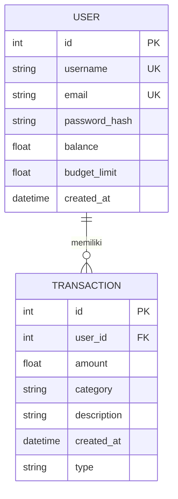

# 💰 FinTrack - Personal Finance Tracker

Aplikasi pencatat keuangan pribadi berbasis web untuk mengelola pemasukan dan pengeluaran, mengatur budget bulanan, dan melihat ringkasan keuangan dengan antarmuka modern dan responsif.


## 🎯 Fitur Utama

### 🔐 Autentikasi & Keamanan
- **Registrasi & Login** dengan validasi ketat
- **Login Fleksibel**: Mendukung login menggunakan **email** atau **username**
- **Password Strength Checker**: Indikator kekuatan password real-time
- **Konfirmasi Password**: Validasi kesamaan password saat registrasi
- **Rate Limiting**: Proteksi brute force (5 percobaan per menit untuk login)
- **Reset Password**: Alur pemulihan akun yang aman

### 💰 Manajemen Keuangan
- **Dashboard**: Ringkasan keuangan dengan kartu saldo 3D interaktif
- **CRUD Transaksi**: Tambah, edit, hapus pemasukan dan pengeluaran
- **Kategori Transaksi**: Gaji, Makanan, Transportasi, Hiburan
- **Budget Management**: Atur dan pantau budget bulanan per pengeluaran
- **Saldo Otomatis**: Perhitungan saldo real-time dengan logika bisnis

### 📊 Analisis & Monitoring
- **Grafik Tren**: Visualisasi pergerakan saldo historis menggunakan ApexCharts
- **Ringkasan Statistik**: Total pemasukan, pengeluaran, dan jumlah transaksi
- **Progress Bar Budget**: Indikator visual pemakaian budget dengan animasi
- **Filter & Pencarian**: Cari transaksi berdasarkan kriteria tertentu

### 📱 Responsive Design
- **Mobile First**: Interface yang adaptif untuk semua perangkat
- **Sidebar Responsive**: Menu hamburger untuk navigasi di mobile
- **Dual View**: Tampilan **List** (tabel) dan **Card** (kartu) untuk transaksi
- **Collapsible Filter**: Filter yang dapat dilipat di mobile

### 🛠️ Fitur Lanjutan
- **Export CSV**: Unduh data transaksi dalam format CSV/Excel
- **Bulk Delete**: Hapus multiple transaksi sekaligus dengan checkbox
- **API Endpoints**: RESTful API untuk pencarian dan penghapusan massal
- **Flash Messages**: Notifikasi sukses/error yang informatif

## 🛠️ Teknologi yang Digunakan

### Backend
| Teknologi | Versi | Fungsi |
|-----------|-------|--------|
| Python | 3.x | Bahasa pemrograman utama |
| Flask | 3.1.3 | Web framework |
| Flask-SQLAlchemy | 3.1.1 | ORM untuk database |
| Flask-Limiter | - | Rate limiting |
| Werkzeug | 3.1.8 | Enkripsi password & utilitas |
| SQLAlchemy | 2.0.51 | Database toolkit |

### Frontend
| Teknologi | Fungsi |
|-----------|--------|
| Jinja2 | Templating engine |
| TailwindCSS (CDN) | Utility-first CSS framework |
| ApexCharts | Library grafik interaktif |
| Flowbite | Komponen UI berbasis Tailwind |
| Font Awesome | Ikon dan simbol |
| Google Fonts (Urbanist) | Font kustom |

### Database
- **SQLite**: Database relasional ringan dan portabel
- **File**: `instance/finance.db` (otomatis dibuat saat pertama kali dijalankan)

## 📁 Struktur Proyek

```
.
├── app.py                 # Aplikasi Flask utama dengan semua routes
├── config.py              # Konfigurasi aplikasi (secret key, database URI)
├── models.py              # Model database (User, Transaction, Income, Expense)
├── requirements.txt       # Daftar dependensi Python
├── erd.md                 # Entity Relationship Diagram (Mermaid)
├── struktur.txt           # Struktur direktori
├── README.md              # Dokumentasi proyek
├── CONTRIBUTING.md        # Panduan kontribusi
├── LICENSE                # Lisensi MIT
├── .gitignore             # File yang diabaikan Git
│
├── instance/              # Folder untuk SQLite database
│   └── finance.db         # Database (otomatis dibuat)
│
└── templates/             # File template HTML (Jinja2)
    ├── auth.html          # Halaman login & register
    ├── base.html          # Template dasar dengan layout & navigasi
    ├── dashboard.html     # Dashboard utama dengan grafik
    ├── edit_transaction.html   # Form edit transaksi
    ├── forgot_password.html    # Halaman lupa password
    ├── reset_password.html     # Halaman reset password
    ├── transaction_form.html   # Form tambah transaksi
    └── transactions.html       # Daftar transaksi dengan filter
```

## 🗄️ Database Schema

### Entity Relationship Diagram



### Model Details

#### 👤 User (Tabel `users`)
| Field | Tipe | Keterangan |
|-------|------|------------|
| `id` | Integer, PK | Identifier unik pengguna |
| `username` | String(80), Unique | Nama pengguna |
| `email` | String(120), Unique | Alamat email |
| `password_hash` | String(256) | Hash password (werkzeug) |
| `_balance` | Numeric(15,2) | Saldo saat ini (default: 0) |
| `budget_limit` | Numeric(15,2) | Batas budget pengeluaran (default: 5.000.000) |

**Properties & Methods:**
- `balance` (property): Getter/Setter dengan validasi saldo tidak boleh negatif
- `set_password(password)`: Hash password menggunakan werkzeug
- `check_password(password)`: Verifikasi password

#### 💳 Transaction (Tabel `transactions`)
| Field | Tipe | Keterangan |
|-------|------|------------|
| `id` | Integer, PK | Identifier unik transaksi |
| `user_id` | Integer, FK | Foreign key ke tabel users |
| `amount` | Numeric(15,2) | Nominal transaksi |
| `category` | String(50) | Kode kategori transaksi |
| `description` | Text | Deskripsi/keterangan |
| `created_at` | DateTime | Waktu transaksi dibuat |
| `type` | String(20) | Discriminator: 'income' atau 'expense' |

#### 💵 Income (Inherits Transaction)
- **Polymorphic Identity**: `'income'`
- `execute_financial_logic(balance)`: Menambah saldo
- `execute_reverse_logic(balance)`: Mengurangi saldo (saat hapus)

#### 💸 Expense (Inherits Transaction)
- **Polymorphic Identity**: `'expense'`
- `execute_financial_logic(balance)`: Mengurangi saldo dengan validasi
- `execute_reverse_logic(balance)`: Menambah saldo (saat hapus)

### Kode Kategori

| Kode | Emoji | Kategori | Tipe Default |
|------|-------|----------|--------------|
| `1` | 💰 | Gaji / Pendapatan | Income |
| `2` | 🍔 | Makanan & Minuman | Expense |
| `3` | 🚗 | Transportasi | Expense |
| `4` | 🍿 | Hiburan / Kebutuhan Hobi | Expense |

## 🛡️ Fitur Keamanan

1. **Password Hashing**: Menggunakan werkzeug untuk hashing password dengan salt
2. **Rate Limiting**: Proteksi endpoint login dari brute force (Flask-Limiter)
3. **Session Security**: Cookie dengan `httponly` flag untuk mencegah akses via JavaScript
4. **Input Validation**: Validasi input di sisi server untuk semua form
5. **Session Validation**: Pengecekan validitas session sebelum setiap request
6. **CSRF Protection**: Konfirmasi aksi berbahaya (hapus transaksi, dll)

## 🚀 Instalasi & Pengaturan

### Prasyarat
- Python 3.8 atau lebih tinggi
- pip (package manager)
- Git (opsional)

### Langkah Instalasi

1. **Kloning Repositori**
   ```bash
   git clone https://github.com/username/fintrack.git
   cd fintrack
   ```

2. **Buat Virtual Environment**
   ```bash
   # Linux/Mac
   python3 -m venv venv
   source venv/bin/activate

   # Windows
   python -m venv venv
   venv\Scripts\activate
   ```

3. **Instal Dependensi**
   ```bash
   pip install -r requirements.txt
   ```

4. **Konfigurasi Environment Variables (Opsional)**
   
   Buat file `.env` atau set environment variable:
   ```bash
   # Linux/Mac
   export SECRET_KEY='your-super-secret-key-here'
   
   # Windows
   set SECRET_KEY=your-super-secret-key-here
   ```

5. **Jalankan Aplikasi**
   ```bash
   python app.py
   ```

6. **Buka Browser**
   - Akses: `http://localhost:5000`
   - atau: `http://127.0.0.1:5000`

### Instalasi Alternatif (Docker)
```bash
# Build image
docker build -t fintrack .

# Run container
docker run -p 5000:5000 fintrack
```

## 📖 Panduan Penggunaan

### 1. Registrasi Akun
- Buka halaman `/auth`
- Klik tab **"Daftar Baru"**
- Isi username, email, dan password
- Perhatikan indikator kekuatan password
- Konfirmasi password
- Klik **"Buat Akun FinTrack"**

### 2. Login
- Masukkan **email** atau **username**
- Masukkan password
- Klik **"Masuk ke Dashboard"**

### 3. Dashboard
- Lihat ringkasan saldo, total pemasukan, dan pengeluaran
- Pantau grafik tren keuangan
- Lihat transaksi terakhir
- Klik **"Set Limit"** untuk mengatur budget

### 4. Mengelola Transaksi
- **Tambah**: Klik tombol **"Catat Transaksi"** atau **"+"**
- **Edit**: Klik ikon pensil pada transaksi
- **Hapus**: Klik ikon tempat sampah dengan konfirmasi
- **Filter**: Gunakan filter untuk mencari transaksi tertentu
- **Bulk Delete**: Pilih beberapa transaksi lalu hapus sekaligus

### 5. Export Data
- Buka halaman **Transaksi**
- Klik tombol **"Export ke Excel (.csv)"**
- File akan diunduh secara otomatis

## 🧪 Development

### Menjalankan dalam Mode Development
```bash
# Aktifkan virtual environment
source venv/bin/activate

# Set FLASK_ENV
export FLASK_ENV=development

# Jalankan aplikasi
python app.py
```

### Menjalankan Test
```bash
# Jalankan pytest
pytest

# Jalankan dengan coverage
pytest --cov=.
```

### Code Quality Check
```bash
# Jalankan flake8
flake8 --select=E,W
```

## 📊 API Endpoints

| Endpoint | Method | Deskripsi |
|----------|--------|-----------|
| `/` | GET | Redirect ke dashboard |
| `/auth` | GET | Halaman login/register |
| `/register` | POST | Proses registrasi |
| `/login` | POST | Proses login |
| `/logout` | GET | Proses logout |
| `/forgot-password` | GET/POST | Lupa password |
| `/reset-password` | GET/POST | Reset password |
| `/dashboard` | GET | Dashboard utama |
| `/transactions` | GET | Daftar transaksi |
| `/transaction/add` | GET/POST | Tambah transaksi |
| `/transaction/edit/<id>` | GET/POST | Edit transaksi |
| `/transaction/delete/<id>` | GET | Hapus transaksi |
| `/update-budget` | POST | Update budget |
| `/transactions/export` | GET | Export CSV |
| `/api/transactions/search` | GET | API pencarian transaksi |
| `/api/transactions/bulk` | POST | API bulk delete |

## 🎨 Customization

### Mengubah Kategori
Edit dictionary kategori di:
- `templates/transactions.html` (fungsi `getCategoryText`)
- `templates/dashboard.html`
- `templates/transaction_form.html`

### Mengubah Batas Budget Default
Edit nilai default di `models.py`:
```python
budget_limit = db.Column(db.Numeric(15, 2), default=5000000.0)
```

### Menambah Kategori Baru
1. Tambah opsi di form HTML
2. Update dictionary di JavaScript
3. Tambah logika di template

## 🐛 Troubleshooting

### Masalah Umum

**1. Database tidak terbuat**
```bash
# Pastikan folder instance ada
mkdir instance

# Jalankan aplikasi untuk membuat database
python app.py
```

**2. ModuleNotFoundError**
```bash
# Pastikan virtual environment aktif
source venv/bin/activate

# Instal ulang dependencies
pip install -r requirements.txt
```

**3. Port sudah digunakan**
```bash
# Ganti port di app.py
app.run(debug=True, port=5001)
```

## 🤝 Kontribusi

Silakan lihat [CONTRIBUTING.md](CONTRIBUTING.md) untuk panduan lengkap berkontribusi.

## 📄 Lisensi

Proyek ini menggunakan lisensi **MIT License** - silakan lihat file [LICENSE](LICENSE) untuk detail.

## 📞 Kontak

**Haykal Furqan Shafiq**
- 🎓 Mahasiswa Ilmu Komputer (Semester 4)
- 📍 Sabang, Aceh, Indonesia
- 💻 GitHub: [@haykalfurqan](https://github.com/haykalfurqan)

## 🙏 Terima Kasih

Terima kasih telah menggunakan **FinTrack**! Semoga aplikasi ini membantu Anda mengelola keuangan pribadi dengan lebih baik.

---

**Catatan:** Aplikasi ini dikembangkan sebagai proyek pembelajaran Pemrograman Berorientasi Objek (PBO) dengan konsep:
- **Enkapsulasi**: Protected attributes dan property
- **Inheritance**: Transaction sebagai parent class
- **Polymorphism**: Method abstract yang di-override di subclass

### Roadmap Pengembangan
- [ ] Multi-user dengan hak akses berbeda
- [ ] Notifikasi email untuk budget hampir terlampaui
- [ ] Integrasi dengan bank API
- [ ] Progressive Web App (PWA) untuk offline
- [ ] Laporan keuangan export PDF
- [ ] Budget per kategori yang lebih detail
- [ ] Recurring transactions (transaksi berulang)
- [ ] Dark mode / Light mode toggle
- [ ] Mobile app (React Native/Flutter)
