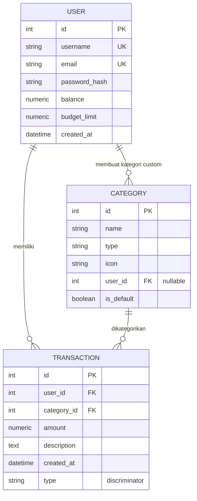
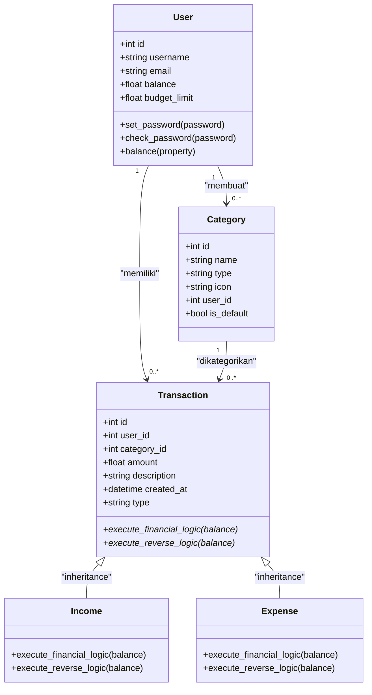

# Entity Relationship Diagram (ERD) - FinTrack

> **Proyek:** Personal Finance Tracker (FinTrack)  
> **Kelompok 5** – Pemrograman Berorientasi Objek (PBO)  
> **Universitas Bina Bangsa Getsempena (UBBG)**

---

## 📌 Deskripsi Model

### 1. User (Tabel `users`)
| Field | Tipe | Keterangan |
|-------|------|------------|
| `id` | Integer, PK | Identifier unik pengguna |
| `username` | String(80), Unique | Nama pengguna |
| `email` | String(120), Unique | Alamat email |
| `password_hash` | String(256) | Hash password (Werkzeug) |
| `_balance` | Numeric(15,2) | Saldo saat ini (di-encapsulate) — default 0 |
| `budget_limit` | Numeric(15,2) | Batas anggaran pengeluaran — default 5.000.000 |
| `created_at` | DateTime | Waktu akun dibuat |

**Methods:**
- `set_password(password)` – hash password
- `check_password(password)` – verifikasi password
- `balance` (property) – getter/setter dengan validasi

---

### 2. Category (Tabel `categories`)
| Field | Tipe | Keterangan |
|-------|------|------------|
| `id` | Integer, PK | Identifier unik kategori |
| `name` | String(100) | Nama kategori (contoh: "Gaji", "Makanan") |
| `type` | String(20) | Jenis kategori: `income` atau `expense` |
| `icon` | String(10) | Emoji ikon (contoh: 💰, 🍔) — default 📦 |
| `user_id` | Integer, FK | Null untuk default, terisi jika kategori custom |
| `is_default` | Boolean | True untuk kategori bawaan sistem |

**Relasi:**
- `user_id` → `User.id` (opsional)

---

### 3. Transaction (Tabel `transactions`)
| Field | Tipe | Keterangan |
|-------|------|------------|
| `id` | Integer, PK | Identifier unik transaksi |
| `user_id` | Integer, FK | Pemilik transaksi |
| `category_id` | Integer, FK | Kategori transaksi |
| `amount` | Numeric(15,2) | Nominal transaksi |
| `description` | Text | Keterangan (opsional) |
| `created_at` | DateTime | Waktu transaksi dibuat |
| `type` | String(20) | Discriminator: `'income'` atau `'expense'` |

**Relasi:**
- `user_id` → `User.id`
- `category_id` → `Category.id`

---

### 4. Income (Subclass dari Transaction)
- **Polymorphic Identity:** `'income'`
- **Method:** `execute_financial_logic(balance)` → `balance + amount` (menambah saldo)
- **Method:** `execute_reverse_logic(balance)` → `balance - amount` (mengurangi saldo saat dihapus)

### 5. Expense (Subclass dari Transaction)
- **Polymorphic Identity:** `'expense'`
- **Method:** `execute_financial_logic(balance)` → `balance - amount` (mengurangi saldo, dengan validasi mencukupi)
- **Method:** `execute_reverse_logic(balance)` → `balance + amount` (menambah saldo saat dihapus)

---

## 📊 Diagram ERD (Mermaid)

---

## 📐 Diagram Inheritance (Polimorfisme)

---

## 🏷️ Kategori Default (Seed Data)

| Icon | Nama | Tipe |
|------|------|------|
| 💰 | Gaji | Income |
| 🎁 | Bonus | Income |
| 📈 | Investasi | Income |
| 🎉 | Hadiah | Income |
| 🍔 | Makanan & Minuman | Expense |
| 🚗 | Transportasi | Expense |
| 🎮 | Hiburan | Expense |
| 👕 | Belanja | Expense |
| 📚 | Pendidikan | Expense |
| 🏥 | Kesehatan | Expense |

> **Catatan:** User dapat menambahkan kategori custom sendiri yang hanya terlihat untuk user tersebut (`is_default = False`, `user_id` terisi).

---

## 🔗 Relasi Antar Tabel

| Relasi | Kardinalitas | Keterangan |
|--------|--------------|------------|
| `User` → `Category` | 1 : 0..* | Satu user bisa membuat banyak kategori custom |
| `User` → `Transaction` | 1 : 0..* | Satu user bisa memiliki banyak transaksi |
| `Category` → `Transaction` | 1 : 0..* | Satu kategori bisa dipakai di banyak transaksi |

---

**Dibuat untuk:** Tugas Akhir Pemrograman Berorientasi Objek (PBO)  
**Kelompok 5:** M Oriza Saltifa, Muhammad Dzaky Mubaraq, Haykal Furqan Shafiq, Reza Fahlevi, Zulfahmi Fikri  
**Dosen Pengampu:** Aji Teguh Prihatno, S.T., M.Sc.

---

> **Catatan:** ERD ini sudah disesuaikan dengan implementasi model di `models.py` dan mencerminkan penggunaan **Enkapsulasi**, **Inheritance**, dan **Polymorphism** sesuai kaidah OOP.