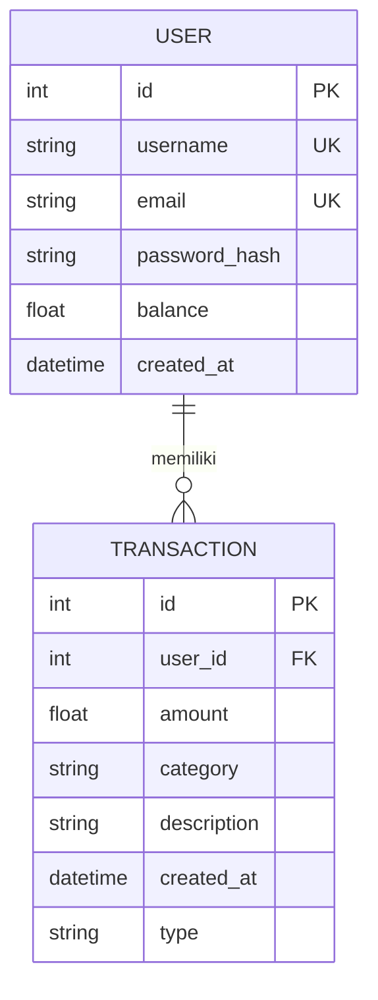
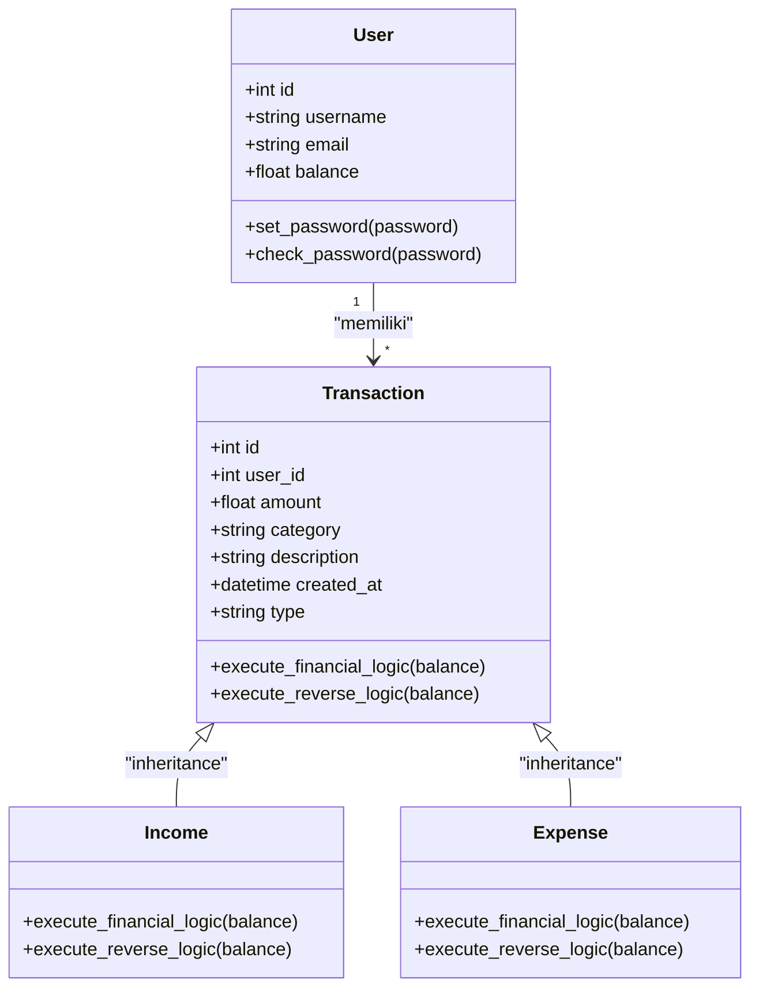

# Entity Relationship Diagram (ERD) - FinTrack

## Deskripsi Model

### 1. User (Tabel `users`)
| Field | Tipe | Keterangan |
|-------|------|------------|
| **id** | Integer, PK | Identifier unik pengguna |
| **username** | String, Unique | Nama pengguna |
| **email** | String, Unique | Alamat email |
| **password_hash** | String | Hash password (werkzeug) |
| **balance** | Float | Saldo saat ini (default: 0) |
| **created_at** | DateTime | Waktu akun dibuat |

### 2. Transaction (Tabel `transactions`)
| Field | Tipe | Keterangan |
|-------|------|------------|
| **id** | Integer, PK | Identifier unik transaksi |
| **user_id** | Integer, FK | Identifier pengguna pemilik transaksi |
| **amount** | Float | Nominal transaksi |
| **category** | String(50) | Kode kategori transaksi |
| **description** | String(255), Nullable | Deskripsi/keterangan transaksi |
| **created_at** | DateTime | Waktu transaksi dibuat |
| **type** | String(20), Discriminator | Tipe transaksi (`income` / `expense`) |

### 3. Income (Inherits dari Transaction)
- **type** = `'income'` (polymorphic_identity)
- **execute_financial_logic**: Menambah saldo (`balance + amount`)
- **execute_reverse_logic**: Mengurangi saldo (`balance - amount`)

### 4. Expense (Inherits dari Transaction)
- **type** = `'expense'` (polymorphic_identity)
- **execute_financial_logic**: Mengurangi saldo (`balance - amount`)
- **execute_reverse_logic**: Menambah saldo (`balance + amount`)

## Diagram ERD



## Diagram Inheritance (Polymorphic)



## Kode Kategori

| Kode | Kategori | Tipe Default |
|------|----------|--------------|
| `1` | 💰 Gaji / Pendapatan | Income |
| `2` | 🍔 Makanan & Minuman | Expense |
| `3` | 🚗 Transportasi | Expense |
| `4` | 🍿 Hiburan / Kebutuhan Hobi | Expense |

## Relasi

```
┌──────────┐       ┌──────────────┐
│   User   │ 1───∞ │  Transaction │
│          │       │              │
│ id (PK)  │       │ id (PK)      │
│ username │       │ user_id (FK) │
│ email    │       │ amount       │
│ password │       │ category     │
│ balance  │       │ description  │
│ created  │       │ type         │
└──────────┘       │ created_at   │
                   └──────┬───────┘
                          │
                    ┌─────┴─────┐
                    │           │
               ┌────▼────┐ ┌───▼────┐
               │ Income  │ │Expense │
               │ type=   │ │ type=  │
               │ income  │ │expense │
               └─────────┘ └────────┘
```

## Flow Transaksi

```
User Submit Form
       │
       ▼
┌─────────────┐
│ Cek tipe    │
│ (income /   │
│  expense)   │
└──────┬──────┘
       │
  ┌────┴────┐
  │         │
  ▼         ▼
Income    Expense
  │         │
  ▼         ▼
balance   balance
= old +   = old -
amount    amount
  │         │
  └────┬────┘
       ▼
  Simpan ke DB
  Update saldo
```
